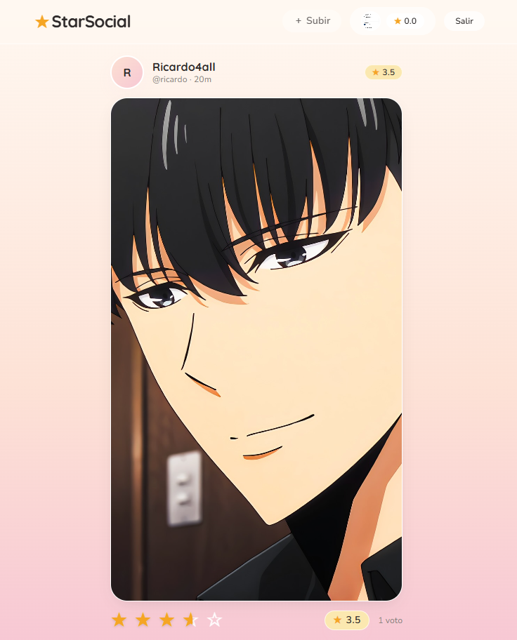
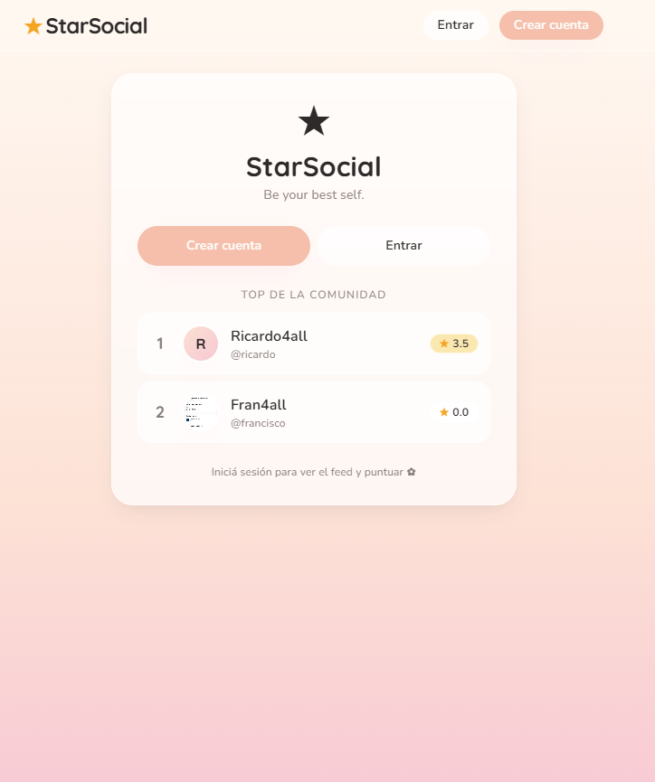

# ★ StarSocial

MVP de una red social inspirada en el episodio *Nosedive* de *Black Mirror*: los usuarios suben fotos o videos cortos y el resto los puntúa de **0.5 a 5 estrellas** (en pasos de media). El promedio de cada persona se muestra como su "ranking social".





## Stack

| Parte | Tecnología |
| --- | --- |
| Frontend | Next.js 14 (App Router) · Tailwind |
| Backend | Flask · SQLAlchemy · JWT |
| DB local | SQLite |
| Auth | JWT en `localStorage` |
| Captura | `getUserMedia` + `MediaRecorder` para foto y video desde el navegador |

## Estructura

```
starsocial/
├── backend/   # API Flask + SQLite
├── frontend/  # Next.js
├── docs/      # capturas para el README
├── LICENSE
└── README.md
```

## Correr en local

### Backend

```bash
cd backend
python -m venv .venv
# Windows
.venv\Scripts\activate
# macOS / Linux
source .venv/bin/activate

pip install -r requirements.txt
cp .env.example .env   # editá si querés
python app.py
```
Queda en `http://127.0.0.1:5000`. La base SQLite (`starsocial.db`) y la carpeta `uploads/` se crean solas.

### Frontend

```bash
cd frontend
npm install
cp .env.example .env.local
npm run dev
```
Abrí `http://localhost:3000`. El frontend proxea `/api/*` y `/uploads/*` al backend, así que no hay que tocar CORS para desarrollo.

## Subir el repo a GitHub

```bash
git init
git add .
git commit -m "first commit: StarSocial MVP"
git branch -M main
git remote add origin git@github.com:<tu-usuario>/starsocial.git
git push -u origin main
```

Lo que **no** se sube (gracias al `.gitignore`):
- `backend/starsocial.db` — base local con tus usuarios
- `backend/uploads/` — fotos y videos que hayas subido
- `node_modules/`, `.next/`, `.venv/`, `__pycache__/`, archivos `.env`

Antes del primer push, corré `git status` y verificá que solo aparezca código fuente.

## Deploy público (gratis)

Recomendación: **Vercel** para el frontend, **Render** o **Railway** para el backend.

### Backend en Render
1. New → Web Service → tu repo → root `backend/`
2. Build: `pip install -r requirements.txt`
3. Start: `gunicorn app:app` (agregar `gunicorn` a `requirements.txt`)
4. Variables de entorno:
   - `STARSOCIAL_SECRET` → string aleatorio largo (`python -c "import secrets;print(secrets.token_hex(32))"`)
   - `FLASK_ENV=production`
   - `ALLOWED_ORIGINS=https://tu-app.vercel.app`
5. Para que las imágenes y la DB persistan entre reinicios, montá un **persistent disk** en `/opt/render/project/src/backend/` (o mejor, mover `uploads/` a S3/R2 y la DB a Postgres).

### Frontend en Vercel
1. Import del repo → root `frontend/`
2. Variable de entorno: `BACKEND_URL=https://tu-backend.onrender.com`
3. Deploy.

La cámara con `getUserMedia` requiere HTTPS — Vercel y Render lo dan por defecto.

## API

| Método | Ruta | Auth | |
| --- | --- | :-: | --- |
| POST | `/api/auth/register` | – | crea usuario |
| POST | `/api/auth/login` | – | login |
| GET  | `/api/me` | ✓ | usuario actual |
| GET  | `/api/users` | – | listado público (alimenta el ranking) |
| GET  | `/api/users/<username>` | ✓ | perfil + posts |
| GET  | `/api/feed` | ✓ | últimos 50 posts |
| POST | `/api/posts` | ✓ | crea post (multipart `media`, `caption`) |
| POST | `/api/posts/<id>/rate` | ✓ | puntúa (`{"stars": 0.5..5}` en pasos de 0.5) |
| DELETE | `/api/posts/<id>` | ✓ | borra post propio |
| POST | `/api/profile/avatar` | ✓ | sube avatar |
| PATCH | `/api/profile` | ✓ | edita `display_name` y `bio` |

## Funcionalidades

- Feed estilo TikTok con scroll vertical y *snap* — un post por pantalla
- Tomar foto o grabar video desde la app (cámara frontal/trasera, con timer de grabación)
- Subida desde galería como alternativa
- Puntuación con **medias estrellas** (clic en mitad izquierda = .5, derecha = entera)
- Borrar publicaciones propias con confirmación
- Avatar editable (foto en vivo o desde galería)
- Vista pública limitada: alguien sin sesión solo ve el podio del ranking

## Licencia

MIT — ver [`LICENSE`](LICENSE). Reemplazá `<your name>` por el tuyo antes de subirlo.
